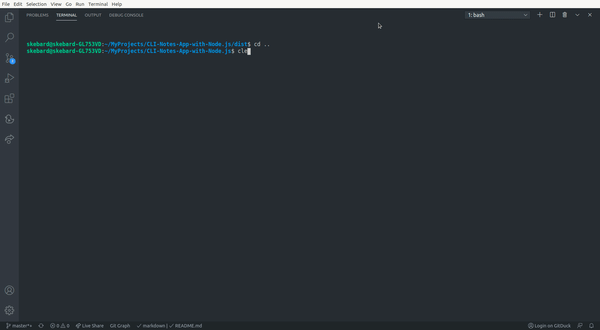

[![LinkedIn][linkedin-shield]][linkedin-url]


<!-- PROJECT LOGO -->
<br />
<p align="center">


  <h1 align="center">CLI Notes App with Node</h1>
  <p align='center'>
  Easy app to create notes from the terminal.
  </p>
</p>


<!-- ABOUT THE PROJECT -->
## About The Project
Add, remove and list notes from your console.

- App in use



<br>


### Built With

- Node.js
- TypeScript


<!-- GETTING STARTED -->
###  Getting Started


1. Clone the repo
   ```
   git clone https://github.com/Skebard/CLI-Notes-App-with-Node.js.git
   ```
2. Make sure you have node and npm installed
```
composer install
```
3. Install NPM dependencies
```
npm install
```
4. Go to the dist file and run your desired commands. For example:
```
node app.js add --title="My first node" --body="I like this tool :)"
```


<!-- CONTRIBUTING -->
### Contributing

Contributions are what make the open source community such an amazing place to be learn, inspire, and create. Any contributions you make are **greatly appreciated**.

1. Fork the Project
2. Create your Feature Branch (`git checkout -b feature/AmazingFeature`)
3. Commit your Changes (`git commit -m 'Add some AmazingFeature'`)
4. Push to the Branch (`git push origin feature/AmazingFeature`)
5. Open a Pull Request


[linkedin-shield]: https://img.shields.io/badge/-LinkedIn-black.svg?style=for-the-badge&logo=linkedin&colorB=555
[linkedin-url]: http://www.linkedin.com/in/tjorda